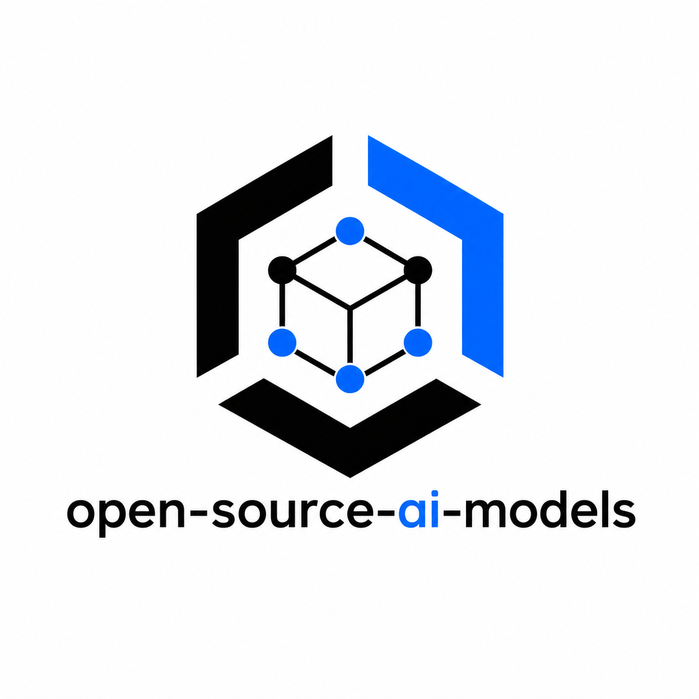

  

# Open Source AI Models

> A curated directory of open-source and open-weight AI models for developers, researchers, and AI builders.

Find the right AI model for coding, OCR, computer vision, image generation, speech, reasoning, RAG, agents, and more — with the parameters, hardware requirements, and license you need to actually decide, not just a link.

This is a **directory**, not an *Awesome List*: every entry lists params, VRAM, context length, license, and best-use-case so you can compare models instead of just discovering them. No minimum star count, no invented numbers — see [Model Selection Criteria](#model-selection-criteria) and [CONTRIBUTING.md](CONTRIBUTING.md).

---

## Contents

- [Featured](#featured)
- [Hardware-Based Recommendations](#hardware-based-recommendations)
- [1. General AI](#1-general-ai)
- [2. Coding](#2-coding)
- [3. Multimodal](#3-multimodal)
- [4. Image Generation](#4-image-generation)
- [5. Image Matting & Background Removal](#5-image-matting--background-removal)
- [6. Audio & Speech](#6-audio--speech)
- [7. Retrieval](#7-retrieval)
- [8. Lightweight & Edge AI](#8-lightweight--edge-ai)
- [9. Document AI (OCR)](#9-document-ai-ocr)
- [10. Computer Vision](#10-computer-vision)
- [11. Video](#11-video)
- [12. Language](#12-language)
- [13. Agents](#13-agents)
- [How to Choose a Model](#how-to-choose-a-model)
- [Model Selection Criteria](#model-selection-criteria)
- [Contributing](#contributing)
- [License](#license)

Every top-level category now has at least one verified entry — subcategories without a dedicated model yet (e.g. Face Analysis, Video Understanding, Summarization, Browser Agents) are still open for contribution, see [Contributing](#contributing).

---

## Featured

**🏆 Best Overall** — [DeepSeek-V3.1](#1-general-ai): 671B/37B-active MoE, hybrid think/non-think mode, 128K context, commercially usable license. [Mistral Large 3](#1-general-ai) (Apache-2.0, 256K context) is the pick if you need a fully permissive license at similar scale.

**💻 Best Coding Models** — [Qwen3-Coder-480B-A35B-Instruct](#2-coding) for server-scale agentic coding; [Qwen3-Coder-30B-A3B-Instruct](#2-coding) or [Devstral Small 2507](#2-coding) for local/single-GPU agentic use; [Codestral 2](#2-coding) for IDE autocomplete (256K context, Apache-2.0).

**🧠 Best Reasoning Models** — [DeepSeek-R1](#1-general-ai) (MIT, frontier, distillation source), [Qwen3-235B-A22B-Thinking-2507](#1-general-ai) (262K context), [QwQ-32B](#1-general-ai) (single-GPU, ~24 GB Q4).

**👁️ Best Vision-Language Models** — [Gemma 3 27B](#3-multimodal) or [Pixtral-12B-2409](#3-multimodal) (both permissive, commercial-friendly); [InternVL3-78B](#3-multimodal) for SOTA open perception/reasoning; [Molmo-72B](#3-multimodal) for full data+code+weights openness; [Phi-4-multimodal-instruct](#3-multimodal) (MIT) for small tri-modal (text+image+audio) on modest hardware.

**✂️ Best Background Removal Models** — [BiRefNet](#5-image-matting--background-removal) (MIT, highest quality/resolution) for general use; [U2-Net](#5-image-matting--background-removal) family (Apache-2.0) for subject-specific variants (Human, Cloth, Anime via IS-Net); [Silueta](#5-image-matting--background-removal) (~43 MB) when file size matters more than accuracy.

**🎨 Best Image Generation Models** — [FLUX.1 \[schnell\]](#4-image-generation) or [Qwen-Image](#4-image-generation) for commercial use (both Apache-2.0); [FLUX.1 \[dev\]](#4-image-generation) / [Stable Diffusion 3.5 Large](#4-image-generation) for max quality, non-commercial or under-$1M-revenue only; [HunyuanImage 3.0](#4-image-generation) for largest open model (80B/13B active).

**🔎 Best Upscaler Models** — [Real-ESRGAN](#super-resolution--upscaling) (BSD-3-Clause) for general photo/anime-video upscaling; [GFPGAN](#super-resolution--upscaling) (Apache-2.0) to pair with it for face restoration; [SwinIR](#super-resolution--upscaling) (Apache-2.0) for transformer-based SOTA restoration.

**🎙️ Best Speech-to-Text Models** — [Whisper large-v3](#6-audio--speech): Apache-2.0, multilingual, runs on CPU via `whisper.cpp`.

**🗣️ Best Text-to-Speech Models** — [Kokoro-82M](#6-audio--speech) (Apache-2.0, <2 GB, real-time on CPU) for fully commercial use; [F5-TTS](#6-audio--speech) for zero-shot voice cloning (CC-BY-NC-4.0, research only).

**📄 Best OCR Models** — [PaddleOCR-VL](#9-document-ai-ocr) (0.9B, Apache-2.0) and [OvisOCR2](#9-document-ai-ocr) (0.8B, Apache-2.0) for SOTA document parsing at sub-1B size; [GLM-OCR](#9-document-ai-ocr) (0.9B, MIT) for the easiest local/Ollama deployment.

**🔍 Best Retrieval / Embedding Models** — [Qwen3-Embedding-0.6B](#7-retrieval) or [nomic-embed-text-v1.5](#7-retrieval) for fully-permissive lightweight embeddings; [gte-Qwen2-7B-instruct](#7-retrieval) for top MTEB quality; [bge-reranker-v2-m3](#7-retrieval) (Apache-2.0) to rerank retrieved candidates.

**🪶 Best Small Models** — [Phi-4-mini-instruct](#8-lightweight--edge-ai) (3.8B, MIT) for text-only edge; [Gemma 3 270M](#8-lightweight--edge-ai) or [Qwen3-0.6B](#8-lightweight--edge-ai) for sub-1B edge/mobile/browser deployment; [Gemma 3 4B](#8-lightweight--edge-ai) for on-device multimodal.

**🔒 Best for Local / Private AI** — [Qwen3-32B](#1-general-ai) and [Qwen3-Coder-30B-A3B-Instruct](#2-coding): both Apache-2.0, run at ~24 GB VRAM quantized.

**👁️‍🗨️ Best Computer Vision Models** — [SAM 2](#10-computer-vision) (Apache-2.0) for promptable segmentation; [DINOv2](#10-computer-vision) (Apache-2.0) for general-purpose visual embeddings; [YOLO11](#10-computer-vision) for real-time detection (AGPL-3.0 — check commercial terms).

**🎬 Best Video Generation Models** — [Wan2.2](#11-video) (Apache-2.0, runs on a single 24 GB GPU) for fully commercial-friendly video generation; [HunyuanVideo](#11-video) for highest quality (Tencent Community License, MAU-capped).

**🌐 Best Translation Models** — [M2M100](#12-language) (MIT, fully commercial) for permissive any-to-any translation; [NLLB-200](#12-language) for the broadest language coverage (CC-BY-NC-4.0, research only).

**🤖 Best Agent Models** — [UI-TARS](#13-agents) (Apache-2.0) for end-to-end GUI agents; [Holo1.5-7B](#13-agents) (Apache-2.0) for web-agent UI grounding; [Magma-8B](#13-agents) (MIT) for agents spanning digital + physical (robotics) tasks.

---

## Hardware-Based Recommendations

| Tier | Recommended models |
|---|---|
| 🟢 CPU | Whisper large-v3 (via whisper.cpp), BGE-M3, BiRefNet, PaddleOCR-VL, OvisOCR2, GLM-OCR, PP-OCRv6, Kokoro-82M, nomic-embed-text-v1.5, mxbai-embed-large-v1, Gemma 3 270M, Qwen2.5-0.5B-Instruct, SmolLM2-1.7B, Qwen3-0.6B, TinyLlama-1.1B, Real-ESRGAN, GFPGAN, SwinIR, InSPyReNet, M2M100, XLM-RoBERTa-large |
| 🟢 8 GB VRAM | Qwen3-Embedding-0.6B, Phi-4-mini-instruct, Gemma 3 4B, Qwen2.5-VL-3B-Instruct, Nanonets-OCR-s, dots.ocr, GOT-OCR2.0, Granite-4.1-8B, Seed-Coder-8B-Instruct, OpenCoder-8B-Instruct, CodeGemma 7B, F5-TTS, Chatterbox, Llama 3.2 1B, Falcon-H1-1.5B-Instruct, OpenELM-3B-Instruct, Phi-4-multimodal-instruct, SmolVLM2-2.2B-Instruct, RMBG-2.0, ColQwen2, snowflake-arctic-embed-l-v2.0, Qwen3-Reranker-0.6B, UI-TARS (7B), Holo1.5-7B, Magma-8B |
| 🟢 24 GB VRAM | Qwen3-32B (Q4), QwQ-32B (Q4), ERNIE-4.5-21B-A3B (Q4), Qwen3-Coder-30B-A3B-Instruct (Q4), Devstral Small 2507 (Q4), Qwen2.5-Coder-32B-Instruct (Q4), DeepSeek-Coder-V2-Lite-Instruct, StarCoder2-15B (Q4), Codestral 2 (Q4), Gemma 3 27B (Q4), Pixtral-12B-2409, Ovis2.5-9B, Moshi, gte-Qwen2-7B-instruct, FLUX.1 [dev] (quantized), Qwen-Image (quantized), SDXL 1.0, Stable Diffusion 3.5 Large (quantized), Chroma1-HD, PixArt-Σ, Kolors, Wan2.2 (TI2V-5B, 720p), LTX-Video (13B, quantized) |
| 🟢 48 GB+ VRAM | DeepSeek-V3.1, DeepSeek-R1, Mistral Large 3, Kimi K2 Instruct, Command A+, MiniMax-M2, Kimi-Dev-72B, Falcon-H1-34B-Instruct, Jamba Large 1.7, Grok-2, Qwen3-235B-A22B-Thinking-2507, Llama 4 Scout, Qwen3-Coder-480B-A35B-Instruct, HunyuanImage 3.0, HunyuanVideo, Molmo-72B, InternVL3-78B, Qwen2.5-VL-72B-Instruct *(multi-GPU or aggressive quantization at this tier)* |
| 🍎 Apple Silicon | Whisper large-v3 (MLX/whisper.cpp), Qwen3-32B (MLX/GGUF), Phi-4-mini-instruct (MLX/GGUF), SmolLM2-1.7B, Qwen3-0.6B, Moshi (MLX build) |

VRAM figures are approximate, quantization-dependent estimates for guidance only — verify against each model's official card before provisioning hardware.

---

## 1. General AI

General-purpose LLMs, reasoning, and instruction-following models.

### General LLM

| Model | Params | Context | VRAM | License | Best For |
|---|---:|---:|---:|---|---|
| [Llama 4 Scout](https://www.llama.com/docs/model-cards-and-prompt-formats/llama4/) | 109B total / 17B active (MoE) | 10M tokens | ~66 GB (int4, active experts) / multi-GPU for full weights | Llama 4 Community License (commercial allowed under 700M MAU) | General LLM, long-context, multimodal (text+image in) |
| [Qwen3-32B](https://huggingface.co/Qwen/Qwen3-32B) | 32B (dense) | 32K native / 131K (YaRN) | ~24 GB (Q4) / ~64 GB (fp16) | Apache-2.0 | General LLM, instruction following, reasoning toggle |
| [DeepSeek-V3.1](https://huggingface.co/deepseek-ai/DeepSeek-V3.1) | 671B total / 37B active (MoE) | 128K | Multi-GPU (>400 GB fp8) | DeepSeek Model License (commercial use allowed) | Reasoning, general LLM, hybrid think/non-think mode |
| [Mistral Large 3](https://docs.mistral.ai/models/model-cards/mistral-large-3-25-12) | 675B total / 41B active (MoE) | 256K | Multi-GPU (>400 GB fp8) | Apache-2.0 | Flagship open-weight general LLM, long-context |
| [Kimi K2 Instruct](https://huggingface.co/moonshotai/Kimi-K2-Instruct) | 1T total / 32B active (MoE) | 128K | Multi-GPU (native INT4, still >500 GB) | Modified MIT (attribution required above 100M MAU / $20M mo. revenue) | Drop-in general-purpose chat + agentic use, no long "thinking" |
| [Command A+](https://docs.cohere.com/docs/command-a-plus) | 218B total / 25B active (MoE) | 128K input / 64K output | 2× H100 (fp8) / 1× B200 | Apache-2.0 | Enterprise agentic + RAG with native citation grounding, 48 languages |
| [ERNIE-4.5-21B-A3B](https://huggingface.co/baidu/ERNIE-4.5-21B-A3B-PT) | 21B total / 3B active (MoE) | 128K | ~16 GB (Q4) | Apache-2.0 | Efficient general LLM on a single mid-range GPU |
| [OLMo 2 32B](https://allenai.org/olmo/release-notes) | 32B (dense) | 4K native / 8K (RoPE-scaled) | ~20 GB (Q4) / ~64 GB (fp16) | Apache-2.0 (weights) / ODC-BY (Dolma 2 data) | Fully open reproducible research (weights + training data + code + checkpoints) |
| [Falcon-H1-34B-Instruct](https://huggingface.co/tiiuae/Falcon-H1-34B-Instruct) | 34B (dense, hybrid) | 256K | ~20 GB (Q4) / ~68 GB (fp16) | Apache-2.0 | Long-context on a hybrid Transformer+SSM architecture, efficient memory use |
| [Jamba Large 1.7](https://huggingface.co/ai21labs/AI21-Jamba-Large-1.7) | 398B total / 94B active (hybrid MoE) | 256K | Multi-GPU (>200 GB, quantized) | Jamba Open Model License (commercial use allowed) | Long-context enterprise workloads, fastest inference at long context in its class |
| [Grok-2](https://huggingface.co/xai-org/grok-2) | ~270B | Not officially documented | Multi-GPU (8× 40GB+, tensor parallel) | xAI Community License (free research/non-commercial; commercial use requires following xAI's separate terms) | Legacy frontier model for research; cannot be used to train competing models |

- **Llama 4 Scout**: MoE with 16 experts; the 10M-token context is Meta's advertised maximum and needs specialized long-context serving. Larger sibling Llama 4 Maverick (400B total / 17B active, 1M context) exists for higher-quality workloads.
- **Qwen3-32B**: part of the Qwen3 dense family (0.6B–32B); larger MoE variants (30B-A3B, 235B-A22B) trade dense simplicity for throughput at similar active-parameter cost.
- **DeepSeek-V3.1**: code released under MIT; model weights follow DeepSeek's own model license. 128K is the documented baseline context; some providers expose up to 163,840 tokens.
- **Mistral Large 3**: Mistral's flagship, trained from scratch (3,000 H200 GPUs); both base and instruct checkpoints are Apache-2.0 — a fully permissive license at this scale is still rare among 600B+ models.
- **Kimi K2 Instruct**: the non-thinking, "reflex-grade" counterpart to Kimi K2 Thinking (see [Reasoning](#reasoning) below) — same 1T/32B-active architecture, tuned for fast drop-in chat/agentic use rather than long chain-of-thought.
- **Command A+**: unifies Cohere's prior Command A, Command A Reasoning, Command A Vision, and Command A Translate models into one checkpoint; notable for native multimodal input and built-in citation/grounding spans. Cohere's earlier Command A/R/R+ models were CC-BY-NC (non-commercial) — Command A+ is Cohere's first entry in this family under a fully permissive Apache-2.0 license.
- **ERNIE-4.5-21B-A3B**: part of Baidu's ERNIE 4.5 family (0.3B–424B, all Apache-2.0); this size is the practical sweet spot for running a modern MoE general LLM on a single consumer GPU.
- **OLMo 2 32B**: Allen Institute for AI's fully open release — unlike the other entries here, it publishes not just weights but the full Dolma 2 pretraining dataset, training code, every intermediate checkpoint, and post-training recipes, at the cost of a much shorter native context window (4K, RoPE-extendable to 8K) than the other models in this table.
- **Falcon-H1-34B-Instruct**: TII's hybrid-head architecture combines Transformer attention with a State Space Model (Mamba-style) for long-range memory at lower compute cost; the family spans 0.5B–34B, all Apache-2.0, all sharing the same 256K context.
- **Jamba Large 1.7**: AI21's production-grade hybrid Mamba-Transformer MoE; the Jamba Open Model License is a custom but commercially-permissive license (not Apache/MIT) — read its terms before large-scale deployment. A smaller Jamba Mini 1.5 (52B total / 12B active) exists for lighter workloads.
- **Grok-2**: xAI's 2024 flagship, open-weighted in August 2025 after being superseded by newer proprietary Grok versions; ~500GB across 42 files, requiring 8×40GB+ GPUs with tensor parallelism. The xAI Community License is free for research/non-commercial use but imposes real restrictions on commercial deployment and explicitly prohibits using it to train competing models — treat as **Commercial Restricted**, not a plain permissive license.

### Reasoning

Dedicated reasoning / "thinking" models — trained or tuned for long chain-of-thought before answering (math, logic, science, code).

| Model | Params | Context | VRAM | License | Best For |
|---|---:|---:|---:|---|---|
| [DeepSeek-R1](https://huggingface.co/deepseek-ai/DeepSeek-R1) | 671B total / 37B active (MoE) | 128K | Multi-GPU (>400 GB fp8) | MIT | Frontier open reasoning, distillation source for smaller models |
| [Qwen3-235B-A22B-Thinking-2507](https://huggingface.co/Qwen/Qwen3-235B-A22B-Thinking-2507) | 235B total / 22B active (MoE) | 262K native | Multi-GPU (>120 GB, quantized) | Apache-2.0 | Scaled thinking mode, math/science/coding benchmarks |
| [QwQ-32B](https://huggingface.co/Qwen/QwQ-32B) | 32.5B (dense) | 131K | ~24 GB (Q4) / ~64 GB (fp16) | Apache-2.0 | Reasoning on a single high-end GPU, local/private use |
| [gpt-oss-120b](https://huggingface.co/openai/gpt-oss-120b) | 117B total / 5.1B active (MoE) | 128K | ~80 GB (native MXFP4) / single 80 GB GPU | Apache-2.0 | OpenAI's first open-weight reasoning model, strong tool use |
| [Kimi K2 Thinking](https://huggingface.co/moonshotai/Kimi-K2-Thinking) | 1T total / 32B active (MoE) | 256K (262,144) | Multi-GPU (native INT4, still >500 GB) | Modified MIT (must display "Kimi K2" if >100M MAU or >$20M/mo revenue) | Long-horizon agentic reasoning, hundreds of sequential tool calls |
| [GLM-4.6](https://huggingface.co/zai-org/GLM-4.6) | 355B total (MoE) | 200K input / 128K output | Multi-GPU (>200 GB, quantized) | MIT | Frontier open reasoning + coding + agentic tasks |
| [Magistral Small](https://huggingface.co/mistralai/Magistral-Small-2509) | 24B (dense) | 128K (reliable to ~40K) | ~16 GB (Q4) / ~48 GB (fp16) | Apache-2.0 | Reasoning on a single mid-range GPU, built on Mistral Small 3.2 |

- **DeepSeek-R1**: MIT license explicitly permits distillation and commercialization — the most widely used teacher model for smaller open reasoning models.
- **Qwen3-235B-A22B-Thinking-2507**: the dedicated "thinking" checkpoint of Qwen3-235B-A22B (separate from the default instruct checkpoint). Qwen recommends context well above 131K for long chain-of-thought tasks.
- **QwQ-32B**: dense, built on Qwen2.5 architecture — the best option here for reasoning on a single consumer/prosumer GPU rather than a multi-GPU server. Supersedes an earlier Nov-2024 "Preview" (32K context).
- **gpt-oss-120b**: OpenAI's first open-weight release since GPT-2; uses alternating dense/locally-banded-sparse attention and ships natively in MXFP4, making the 117B-total model fit on a single 80 GB GPU. A smaller sibling, gpt-oss-20b (21B total / 3.6B active), targets ~16 GB VRAM.
- **Kimi K2 Thinking**: interleaves step-by-step reasoning with tool calls across hundreds of turns without drift; ships as native INT4 to keep the 1T-parameter model's memory footprint down. The "Modified MIT" license is permissive but requires visible attribution at very large scale (100M+ MAU or $20M+/month revenue). Distinct from **Kimi K2 Instruct** (see [General LLM](#general-llm) above) — same 1T/32B-active base architecture, but Instruct is the fast non-thinking variant while Thinking is tuned for long chain-of-thought.
- **GLM-4.6**: Zhipu/Z.ai's frontier MoE, expanded from GLM-4.5's 128K to a 200K input context, with explicit improvements to coding, reasoning, long-context, and agentic tool use.
- **Magistral Small**: the only dense, single-GPU-friendly model in this list's upper tier; built on Mistral Small 3.2 with SFT from Magistral Medium reasoning traces plus RL. Its larger sibling, Magistral Medium (~45B), is API-only (not open-weight).

---

## 2. Coding

Code generation, completion, and coding-agent models.

| Model | Params | Context | VRAM | License | Best For |
|---|---:|---:|---:|---|---|
| [Qwen3-Coder-480B-A35B-Instruct](https://huggingface.co/Qwen/Qwen3-Coder-480B-A35B-Instruct) | 480B total / 35B active (MoE) | 256K native / 1M (YaRN) | Multi-GPU (>240 GB, quantized) | Apache-2.0 | Coding agents, repository-scale understanding |
| [Qwen3-Coder-30B-A3B-Instruct](https://huggingface.co/Qwen/Qwen3-Coder-30B-A3B-Instruct) | 30B total / 3B active (MoE) | 256K native / 1M (YaRN) | ~24 GB (Q4) | Apache-2.0 | Local coding agent, single-GPU / high-end consumer setups |
| [MiniMax-M2](https://huggingface.co/MiniMaxAI/MiniMax-M2) | 229.9B total / 9.8B active (MoE) | ~205K | Multi-GPU (>110 GB, quantized) | MIT-style (attribution required above 100M MAU / $30M ARR) | Long-horizon agentic coding, tool-first design |
| [Devstral Small 2507](https://huggingface.co/mistralai/Devstral-Small-2507) | 24B (dense) | 128K | ~16 GB (Q4) / single RTX 4090 or 32 GB Mac | Apache-2.0 | Agentic software-engineering, SWE-bench-tuned local coding agent |
| [Qwen2.5-Coder-32B-Instruct](https://huggingface.co/Qwen/Qwen2.5-Coder-32B-Instruct) | 32.5B (dense) | 32K native / 128K (YaRN) | ~24 GB (Q4) / ~64 GB (fp16) | Apache-2.0 | General code generation/completion, most widely adopted open coding dense model |
| [Codestral 2](https://huggingface.co/mistralai/Codestral-22B-v0.2) | 22B (dense) | 256K | ~16 GB (Q4) / ~44 GB (fp16) | Apache-2.0 (relicensed April 2026; originally Mistral Non-Production) | IDE autocomplete / fill-in-the-middle, 80+ languages |
| [StarCoder2-15B](https://huggingface.co/bigcode/starcoder2-15b) | 15B (dense) | 16K (4K sliding window) | ~10 GB (Q4) / ~32 GB (fp16) | BigCode OpenRAIL-M | Transparent training data (Software Heritage IDs), fill-in-the-middle |
| [Granite-4.1-8B](https://huggingface.co/ibm-granite/granite-4.1-8b) | 8B (dense) | up to 512K | ~6 GB (Q4) / ~16 GB (fp16) | Apache-2.0 | Long-context enterprise coding, RAG, and tool calling |
| [Seed-Coder-8B-Instruct](https://huggingface.co/ByteDance-Seed/Seed-Coder-8B-Instruct) | 8B (dense) | 32K | ~6 GB (Q4) / ~16 GB (fp16) | Apache-2.0 | Lightweight code generation, self-curated training data |
| [CodeGemma 7B](https://huggingface.co/google/codegemma-7b-it) | 7B (dense) | 8K | ~6 GB (Q4) / ~16 GB (fp16) | Gemma Terms of Use (commercial allowed) | Fast code completion on modest hardware |
| [DeepSeek-Coder-V2-Lite-Instruct](https://huggingface.co/deepseek-ai/DeepSeek-Coder-V2-Lite-Instruct) | 16B total / 2.4B active (MoE) | 128K | ~10 GB (Q4) / ~32 GB (fp16) | DeepSeek Model License (commercial use allowed) | 338-language code support, single-GPU MoE coding |
| [Kimi-Dev-72B](https://huggingface.co/moonshotai/Kimi-Dev-72B) | 72B (dense) | 131K | Multi-GPU (>72 GB, quantized) | MIT | Real-repo bug fixing (RL-trained via test suite execution), SWE-bench |
| [OpenCoder-8B-Instruct](https://huggingface.co/infly/OpenCoder-8B-Instruct) | 8B (dense) | 8K | ~6 GB (Q4) / ~16 GB (fp16) | OpenCoder License (custom; commercial use permitted per model card) | Fully reproducible open code LLM (open data + code + weights), EN/ZH |

- Both Qwen3-Coder variants share the same architecture, tuned specifically for agentic coding workflows (tool use, long-context repo understanding) rather than general chat. The 480B model targets server/multi-GPU deployment; 30B-A3B is the practical local/single-GPU choice.
- **MiniMax-M2**: sparse MoE with a "tool-first" design for long-horizon software-engineering and live production troubleshooting; the MIT-style license only requires visible attribution at massive commercial scale (100M+ MAU or $30M+ ARR), otherwise unrestricted.
- **Devstral Small 2507**: built by Mistral AI with All Hands AI specifically for agentic coding; was the #1 open-source model on SWE-bench at release and is light enough for a single RTX 4090 or 32 GB Apple Silicon Mac.
- **Qwen2.5-Coder-32B-Instruct**: the previous-generation Qwen coding model (dense, not MoE) — still one of the most widely fine-tuned and quantized open coding models due to its broad tooling support.
- **Codestral 2**: Mistral's dedicated FIM/autocomplete model; the original 22B (2024) shipped under a non-commercial Mistral license, but was relicensed to Apache-2.0 in April 2026 — verify you're using the relicensed weights before commercial use.
- **StarCoder2-15B**: from the BigCode collaboration (Hugging Face + ServiceNow + NVIDIA); BigCode OpenRAIL-M is an open **responsible-AI license**, not a plain permissive license like Apache/MIT — it includes use-based restrictions, so check the license text for your use case rather than assuming Apache-2.0-equivalent freedom.
- **Granite-4.1-8B**: IBM's long-context dense model (context extendable to 512K), built for instruction following, tool calling, RAG, and coding — notable for enterprise-friendly Apache-2.0 licensing at very long context.
- **Seed-Coder-8B-Instruct**: ByteDance Seed's lightweight code model family (also has -Base and -Reasoning variants, the latter at 64K context); notable for a training pipeline where the model curates its own training data.
- **CodeGemma 7B**: part of the Gemma family, tuned specifically for code completion/chat; smallest context window in this table (8K) but runs comfortably on modest hardware.
- **DeepSeek-Coder-V2-Lite-Instruct**: sibling to the larger 236B/21B-active DeepSeek-Coder-V2-Instruct; the Lite variant's low active-parameter count makes it practical on a single GPU while retaining MoE efficiency and broad language coverage.
- **Kimi-Dev-72B**: built on Qwen2.5-72B, trained with large-scale RL that applies patches to real repositories and validates them against full test suites — rewards only correctness, not just plausible-looking diffs. MIT-licensed.
- **OpenCoder-8B-Instruct**: from infly, notable for releasing the full training pipeline (2.5T pretraining tokens, 4.5M+ SFT examples) alongside weights — a reproducibility-focused alternative to Seed-Coder/StarCoder2 at a similar size. The license is a custom "OpenCoder License," not literally MIT/Apache — verify the exact terms in the repo before commercial use despite the model card describing it as permissive.
- For general-purpose models that also perform reasonably at code (e.g. DeepSeek-V3.1, GLM-4.6), see [General AI](#1-general-ai).

---

## 3. Multimodal

Vision-language and other cross-modal models.

| Model | Params | Context | VRAM | License | Best For |
|---|---:|---:|---:|---|---|
| [Gemma 3 27B](https://huggingface.co/google/gemma-3-27b-it) | 27B | 128K | ~24 GB (Q4) / ~54 GB (fp16) | Gemma Terms of Use (commercial allowed) | Vision-language, multilingual multimodal reasoning |
| [Molmo-72B](https://huggingface.co/allenai/Molmo-72B-0924) | 72B | N/A (not separately documented) | Multi-GPU (>72 GB, quantized) | Apache-2.0 | Fully open VLM — weights + PixMo training data + code all released |
| [InternVL3-78B](https://huggingface.co/OpenGVLab/InternVL3-78B) | 78B | 32K (usable to ~64K) | Multi-GPU (>78 GB, quantized) | Apache-2.0 | SOTA open-source perception + reasoning among open VLMs |
| [Pixtral-12B-2409](https://huggingface.co/mistralai/Pixtral-12B-2409) | 12B + 400M vision encoder | 128K | ~24 GB (fp16) / ~12 GB (quantized) | Apache-2.0 | Natural image + document understanding, variable image resolution |
| [Qwen2.5-VL-72B-Instruct](https://huggingface.co/Qwen/Qwen2.5-VL-72B-Instruct) | 73.4B | 128K (32K native, YaRN-extended) | Multi-GPU (>73 GB, quantized) | Qwen License (commercial allowed; request required above 100M MAU) | Flagship vision-language, document/video/agent understanding |
| [Phi-4-multimodal-instruct](https://huggingface.co/microsoft/Phi-4-multimodal-instruct) | 5.6B | 128K | ~6 GB (Q4) / ~12 GB (fp16) | MIT | Small tri-modal model (text + image + audio in, text out) |
| [Kimi-VL-A3B-Thinking](https://huggingface.co/moonshotai/Kimi-VL-A3B-Thinking) | 16B total / 2.8B active (MoE) | 128K | ~10 GB (Q4) / ~20 GB (fp16) | Modified MIT | Efficient long-chain-of-thought visual reasoning, ultra-high-res input |
| [Ovis2.5-9B](https://huggingface.co/AIDC-AI/Ovis2.5-9B) | 9B | Not separately documented | ~10 GB (Q4) / ~20 GB (fp16) | Apache-2.0 | SOTA under-40B open VLM, optional reflective "thinking" mode, strong OCR |
| [SmolVLM2-2.2B-Instruct](https://huggingface.co/HuggingFaceTB/SmolVLM2-2.2B-Instruct) | 2.2B (also 256M, 500M) | Not separately documented | ~2 GB (Q4) / ~5 GB (fp16) | Apache-2.0 | Small on-device image + video understanding |

- Gemma 3's 4B, 12B, and 27B variants all accept text + image input with text output; the 1B variant is text-only (see [Lightweight & Edge AI](#8-lightweight--edge-ai)).
- Google's Gemma license is a custom permissive license, not Apache/MIT — classify as **Commercial Allowed**, not plain "Open Source."
- Llama 4 (see [General AI](#1-general-ai)) is also multimodal (text + image in, text out) and can be cross-referenced for larger-scale vision-language needs.
- **Molmo-72B**: Allen Institute for AI's flagship VLM — notable because Ai2 released not just Apache-2.0 weights but the full PixMo training dataset, fine-tuning data, and code, unlike most other entries in this table. A smaller MolmoE-1B (MoE, 1B active/7B total) variant exists for on-device use.
- **InternVL3-78B**: OpenGVLab's "Native Multimodal Pre-Training" model family (also available at 2B/8B/38B); state-of-the-art among open-weight VLMs on several perception/reasoning benchmarks at release, Apache-2.0.
- **Pixtral-12B-2409**: Mistral's first vision-language model; ingests images at their natural resolution/aspect ratio rather than a fixed size, and doesn't trade off text-only benchmark performance to gain vision capability.
- **Qwen2.5-VL-72B-Instruct**: unlike the smaller 3B/7B Qwen2.5-VL sizes (Apache-2.0, see [Document AI](#9-document-ai-ocr)), the 72B carries the custom **Qwen License** — commercial use is allowed, but products/services above 100M monthly active users must request a separate license from Alibaba. Don't assume Apache-2.0 terms carry over from the smaller sizes.
- **Phi-4-multimodal-instruct**: the smallest and only genuinely tri-modal (text+image+audio in) model in this table; MIT-licensed and built on the Phi-4-mini backbone with added vision/speech encoders — a good fit when you need multimodal input on modest hardware rather than frontier-scale VLM quality.
- **Kimi-VL-A3B-Thinking**: MoE vision-language model built on Moonshot's "Moonlight" backbone (16B total, only 2.8B active) with a native-resolution MoonViT encoder; the "Thinking" variant adds long chain-of-thought via SFT+RL on top of the base Kimi-VL-A3B-Instruct.
- **Ovis2.5-9B**: Alibaba AIDC's vision-language model with an optional inference-time "thinking" mode (self-checking/revision) to trade latency for accuracy; a smaller 2B variant also exists. Apache-2.0.
- **SmolVLM2-2.2B-Instruct**: Hugging Face's small VLM family, pairing a SigLIP vision encoder with a Gemma 2 language backbone; the 256M and 500M sizes are among the smallest video-capable language models released, suitable for genuinely edge-class multimodal deployment.

---

## 4. Image Generation

| Model | Params | Task | VRAM | License | Best For |
|---|---:|---|---:|---|---|
| [FLUX.1 \[schnell\]](https://huggingface.co/black-forest-labs/FLUX.1-schnell) | 12B | Text-to-Image | ~16 GB (fp16) / ~8 GB (quantized) | Apache-2.0 | Fast text-to-image generation, commercial use |
| [FLUX.1 \[dev\]](https://huggingface.co/black-forest-labs/FLUX.1-dev) | 12B | Text-to-Image | ~24 GB (fp16) / ~12 GB (quantized) | FLUX.1 [dev] Non-Commercial License | Highest-quality open-weight text-to-image, research/personal use |
| [Qwen-Image](https://huggingface.co/Qwen/Qwen-Image) | 20B (MMDiT) | Text-to-Image | ~24 GB (fp16) / ~12 GB (quantized) | Apache-2.0 | Complex text rendering (Chinese + English), infographics/posters/slides |
| [Stable Diffusion 3.5 Large](https://huggingface.co/stabilityai/stable-diffusion-3.5-large) | 8B | Text-to-Image | ~24 GB (fp16) / ~12 GB (quantized) | Stability AI Community License (free under $1M annual revenue) | General text-to-image, non-commercial or small-business use |
| [HunyuanImage 3.0](https://huggingface.co/tencent/HunyuanImage-3.0) | 80B total / 13B active (MoE) | Text-to-Image | Multi-GPU (>80 GB, quantized) | Tencent Hunyuan Community License (free commercial under 100M MAU) | Largest open text-to-image model, native autoregressive text+image |
| [Stable Diffusion XL (SDXL) 1.0](https://huggingface.co/stabilityai/stable-diffusion-xl-base-1.0) | 3.5B base (6.6B w/ refiner) | Text-to-Image | ~12 GB (fp16) / ~6 GB (quantized) | CreativeML OpenRAIL++-M | Mature ecosystem, 1024×1024 native, widest fine-tune/LoRA support |
| [Chroma1-HD](https://huggingface.co/lodestones/Chroma1-HD) | 8.9B | Text-to-Image | ~16 GB (fp16) / ~8 GB (quantized) | Apache-2.0 | Fully commercial-friendly FLUX-derived base model, built for finetuning |
| [PixArt-Σ (Sigma)](https://huggingface.co/PixArt-alpha/PixArt-Sigma-XL-2-1024-MS) | 900M | Text-to-Image (up to 4K) | ~8 GB (fp16) / ~4 GB (quantized) | CreativeML OpenRAIL++-M | Compact, efficient direct 4K generation |
| [Kolors](https://huggingface.co/Kwai-Kolors/Kolors) | ~2.6B | Text-to-Image | ~12 GB (fp16) / ~6 GB (quantized) | Apache-2.0 (code) / Open Weight (free for research; commercial requires registering with Kuaishou) | Strong Chinese-language prompt understanding and generation |

- Both FLUX.1 variants share the same 12B-parameter rectified-flow transformer from Black Forest Labs. **schnell** is distilled for few-step (1–4 step) fast inference and is Apache-2.0 (commercial use allowed); **dev** is the higher-fidelity guidance-distilled variant restricted to non-commercial use. Black Forest Labs also offers **FLUX.1 Pro/Flex** (proprietary, API-only) and **FLUX.1 Kontext [dev]** (12B, image editing, same non-commercial license as [dev]).
- Do not describe FLUX.1 [dev] or Stable Diffusion 3.5 as "open source" — both are **Open Weight** with commercial restrictions (revenue thresholds).
- **Qwen-Image**: Alibaba's 20B MMDiT model, notable for commercial-grade Chinese/English text rendering inside generated images (posters, UI mockups, menus). Apache-2.0 and fully open — note this is distinct from the newer Qwen-Image-3.0, which Alibaba has kept closed (no weights released).
- **Stable Diffusion 3.5**: also ships Medium (2.5B) and Large Turbo (distilled, faster) variants under the same Stability AI Community License — free for non-commercial use and for commercial users under $1M annual revenue; enterprise use above that threshold requires contacting Stability AI.
- **HunyuanImage 3.0**: Tencent's native multimodal (unified autoregressive, not diffusion) image generator — the largest openly released text-to-image model by parameter count as of its release. License is free for commercial use up to 100M monthly active users, with attribution required.
- **SDXL 1.0**: still the most widely fine-tuned/LoRA'd open image model due to its age and ecosystem size; CreativeML OpenRAIL++-M is a responsible-AI license (commercial use allowed with use-based restrictions), not a plain permissive license like Apache/MIT.
- **Chroma1-HD**: an 8.9B community-trained base model derived from FLUX.1-schnell (reduced from 12B by replacing an oversized timestep-encoding layer), explicitly designed as a finetuning starting point; unlike FLUX.1 [dev], it's fully Apache-2.0.
- **PixArt-Σ**: a diffusion-transformer model roughly 10x smaller than SDXL/FLUX yet capable of native 4K generation; note some earlier PixArt-alpha checkpoints ship under plain Apache-2.0 while this Sigma XL-2-1024-MS checkpoint is tagged CreativeML OpenRAIL++-M — check the specific checkpoint you're using.
- **Kolors**: from Kuaishou's Kling team, particularly strong at Chinese-language prompts and text rendering; the training/inference code is Apache-2.0, but the released weights require submitting a commercial-use registration form to Kuaishou — free for research, **not** freely commercial like a plain Apache-2.0 weight release.

### Super Resolution / Upscaling

| Model | Size | Task | Hardware | License | Best For |
|---|---:|---|---|---|---|
| [Real-ESRGAN](https://github.com/xinntao/Real-ESRGAN) | ~17–67 MB per variant | Image/Video Super Resolution (2x/4x) | CPU/GPU | BSD-3-Clause | General photo & anime-video upscaling, most widely deployed upscaler |
| [GFPGAN](https://github.com/TencentARC/GFPGAN) | ~340 MB | Face Restoration + Upscaling | CPU/GPU | Apache-2.0 | Restoring/upscaling faces in old or low-quality photos |
| [SwinIR](https://github.com/JingyunLiang/SwinIR) | ~12 MB (small) – ~120 MB (large) | Image Restoration / Super Resolution | CPU/GPU | Apache-2.0 | Transformer-based SOTA restoration (denoising, JPEG artifact removal, SR) |
| [4x-NMKD-Siax-CX](https://openmodeldb.info/models/4x-NMKD-Siax-CX) | ~67 MB | Super Resolution (4x) | CPU/GPU | WTFPL | Clean/lightly-compressed image upscaling (community ESRGAN-arch model) |

- **Real-ESRGAN**: Xintao Wang's official practical extension of ESRGAN; ships several purpose-built variants including `realesrgan-x4plus` (general photo), `realesrgan-x4plus-anime` (illustrations), and `realesr-animevideov3` (anime video, compact architecture) — the exact model names shown in most upscaler apps (Upscayl, chaiNNer, NMKD Video/Image tools). BSD-3-Clause, fully commercial-friendly.
- **GFPGAN**: from the same Tencent ARC lab as Real-ESRGAN and commonly bundled alongside it (Real-ESRGAN upscales the whole image, GFPGAN specifically restores faces) — Apache-2.0, with some third-party components under their own licenses (see repo for details).
- **SwinIR**: academic (CVPR workshop) Swin-Transformer-based restoration model; still a common baseline/comparison point for newer upscalers. Apache-2.0.
- **4x-NMKD-Siax-CX**: one example of the many community-trained ESRGAN-architecture checkpoints on [OpenModelDB](https://openmodeldb.info/) (a community database, not a single organization) — this one is explicitly WTFPL. Many other popular community checkpoints bundled in upscaler apps (e.g. `4xLSDIR`, `4xLSDIRplusC`, `4xHFA2k`, `4xNomos8kSC`, `NMKD-Superscale`) are trained and released by independent contributors (e.g. Philip Hofmann/Phhofm) **without an explicit stated license** in their repos — treat those as **Unknown** and verify directly with the author before commercial redistribution, rather than assuming they're free to use like Real-ESRGAN/GFPGAN/SwinIR above.

---

## 5. Image Matting & Background Removal

Subcategory tree: General · Human/Portrait · Clothing · Animal · Product · Anime/Illustration. Do not assume every segmentation model is a background-removal model — classify by actual intended use.

| Model | Size | Task | Hardware | License | Specialization |
|---|---:|---|---|---|---|
| [BiRefNet](https://github.com/ZhengPeng7/BiRefNet) | ~880 MB (weights) | Dichotomous Image Segmentation / Matting | CPU/GPU | MIT | General |
| [U2-Net](https://github.com/xuebinqin/U-2-Net) | ~176 MB | Salient Object Detection / Matting | CPU/GPU | Apache-2.0 | General |
| [Silueta](https://github.com/danielgatis/rembg) | ~43 MB | Salient Object Detection / Matting | CPU | Unknown (distilled U2-Net variant; `rembg` wrapper itself is MIT) | General, lightweight |
| [U2-Net (Human Segmentation)](https://github.com/xuebinqin/U-2-Net) | ~168 MB | Portrait / Body Segmentation | CPU/GPU | Apache-2.0 | Human / Portrait |
| [U2-Net (Cloth Segmentation)](https://github.com/levindabhi/cloth-segmentation) | ~168 MB | Clothes Parsing (upper/lower/full body) | CPU/GPU | Apache-2.0 (architecture; verify weight release terms in repo) | Clothing |
| [IS-Net (Anime)](https://github.com/xuebinqin/DIS) | ~168 MB | Dichotomous Image Segmentation | CPU/GPU | Apache-2.0 | Anime / Illustration |
| [RMBG-2.0](https://huggingface.co/briaai/RMBG-2.0) | 221M | Background Removal / Matting | CPU/GPU | Source-available, Research/Non-Commercial (commercial requires a paid license from BRIA AI) | General, commercial-grade e-commerce/gaming/advertising matting |
| [InSPyReNet](https://github.com/plemeri/InSPyReNet) | Not officially documented | High-Resolution Salient Object Detection | CPU/GPU | MIT | General, high-resolution matting (image pyramid architecture) |
| [MODNet](https://github.com/ZHKKKe/MODNet) | ~25 MB (MobileNetV2 backbone) | Real-Time Portrait Matting | CPU/GPU | CC BY-NC-SA-4.0 (official repo; some unofficial ports claim Apache-2.0 — verify source) | Human / Portrait, real-time trimap-free matting |

- **BiRefNet** ("Bilateral Reference Network") targets high-resolution dichotomous image segmentation and is widely used as the backbone for general-purpose background removal tools (e.g. via `rembg` and `transformers.js`). Released by ZhengPeng7 (CAAI AIR '24 paper) under MIT.
- **U2-Net**: the original nested U-structure salient object detection model (Qin et al., Pattern Recognition 2020), Apache-2.0. Its Human and Cloth segmentation variants above share the same architecture but are fine-tuned for those specific subjects — the Cloth variant in most background-removal apps traces back to Levin Dabhi's community-trained checkpoint rather than the original authors' repo, so double-check that repo's license terms before commercial redistribution.
- **Silueta**: a reduced-size (~43 MB, vs. U2-Net's ~176 MB) general-purpose variant shipped as one of `rembg`'s bundled models; the specific weight license isn't separately documented, so treat it as **Unknown** even though `rembg`'s own code is MIT.
- **IS-Net**: from Xuebin Qin et al.'s "Highly Accurate Dichotomous Image Segmentation" (ECCV 2022, `xuebinqin/DIS`), Apache-2.0; commonly repackaged with anime-tuned weights for illustration/anime subjects.
- Model sizes for the Human/Cloth/Anime variants above reflect the file sizes as packaged in common desktop background-removal apps (e.g. Unbagrnd) — official repos may list slightly different sizes depending on export format.
- Community wrapper projects built on top of any of these models may carry their own separate licenses independent of the model weights; verify the wrapper's license separately if redistributing it.
- **RMBG-2.0**: built on the BiRefNet architecture by BRIA AI, trained on 15,000+ manually labeled, fully-licensed commercial images (balanced gender/ethnicity/disability representation) — but unlike BiRefNet itself, RMBG-2.0's weights are **source-available for non-commercial use only**; commercial use requires purchasing a license from BRIA AI directly.
- **InSPyReNet**: from the ACCV 2022 paper "Revisiting Image Pyramid Structure for High Resolution Salient Object Detection"; commonly used via the `transparent-background` PyPI package or the ComfyUI-Inspyrenet-Rembg node. MIT-licensed, fully commercial-friendly.
- **MODNet**: the original trimap-free, real-time portrait-matting model (AAAI 2022); the official `ZHKKKe/MODNet` repository is licensed CC BY-NC-SA-4.0 (non-commercial, share-alike) — treat community forks claiming Apache-2.0 as unofficial re-licensing and verify their provenance before commercial use.

---

## 6. Audio & Speech

| Model | Params | Task | Hardware | License | Best For |
|---|---:|---|---|---|---|
| [Whisper large-v3](https://huggingface.co/openai/whisper-large-v3) | 1.55B | Speech-to-Text | CPU / GPU / Apple Silicon (MLX, whisper.cpp) | Apache-2.0 | Multilingual transcription, translation |
| [Kokoro-82M](https://huggingface.co/hexgrad/Kokoro-82M) | 82M | Text-to-Speech | CPU (<2 GB) | Apache-2.0 | Lightweight, fast, real-time TTS (54 voices, 8 languages) |
| [F5-TTS](https://huggingface.co/SWivid/F5-TTS) | ~330M (DiT) | Text-to-Speech / Voice Cloning | ~4 GB VRAM | CC-BY-NC-4.0 (Research Only; commercial fine-tunes exist separately, e.g. Apache-2.0 OpenF5-TTS-Base) | Zero-shot voice cloning from a few seconds of reference audio |
| [MusicGen](https://huggingface.co/facebook/musicgen-large) | 300M–3.3B | Music Generation | ~8–16 GB VRAM (size-dependent) | Code: MIT / Weights: CC-BY-NC-4.0 (Research Only) | Text-to-music and melody-conditioned generation |
| [Qwen2.5-Omni-7B](https://huggingface.co/Qwen/Qwen2.5-Omni-7B) | 7B | Audio Understanding (+ text/image/video, real-time speech output) | ~16 GB (Q4) / ~20 GB (fp16) | Apache-2.0 | End-to-end audio/multimodal understanding + real-time speech generation |
| [pyannote speaker-diarization-3.1](https://huggingface.co/pyannote/speaker-diarization-3.1) | N/A (segmentation + embedding pipeline) | Speaker Recognition / Diarization | CPU/GPU | MIT | Who-spoke-when diarization for meeting/call transcripts |
| [Chatterbox](https://huggingface.co/ResembleAI/chatterbox) | 500M (Turbo: 350M) | Text-to-Speech / Voice Cloning | ~4 GB VRAM | MIT | Fully commercial TTS + cloning, emotion exaggeration control |
| [Moshi](https://huggingface.co/kyutai/moshiko-pytorch-bf16) | 7B | Real-Time Speech-to-Speech Dialogue | ~16 GB (fp16) / quantized MLX build for Apple Silicon | Weights: CC-BY-4.0 / Inference code: Apache-2.0 | Full-duplex real-time voice conversation (~200ms latency) |
| [OpenAudio S1-mini](https://huggingface.co/fishaudio/openaudio-s1-mini) | 4B (full S1) | Text-to-Speech | ~8 GB (Q4) / ~16 GB (fp16) | CC-BY-NC-SA-4.0 (Research Only) | Expressive TTS (50+ emotions/tones), very low WER |

- Trained on 1M hours of weakly labeled audio + 4M hours of pseudo-labeled audio, using 128 Mel-frequency bins (vs. 80 in large-v2) — a 10–20% error reduction over large-v2 across languages (Whisper large-v3). Smaller distilled/quantized Whisper variants (tiny, base, small, medium) trade accuracy for speed and run well on CPU.
- **Kokoro-82M**: despite its small size, reached #1 on the TTS Spaces Arena leaderboard at launch; runs in real-time or faster on budget CPU hardware, fully Apache-2.0.
- **F5-TTS**: flow-matching + diffusion-transformer voice cloning model; the original SWivid/F5-TTS weights are **CC-BY-NC-4.0** (non-commercial) — don't assume commercial use is fine without a separate license or an explicitly Apache-2.0 community fine-tune.
- **MusicGen**: Meta's text/melody-to-music model; code is MIT but the released **weights are CC-BY-NC-4.0**, restricting the official checkpoints to non-commercial research use.
- **Qwen2.5-Omni-7B**: a genuinely end-to-end omni-modal model (text+image+audio+video in, text+speech out), not audio-only — ranked #1 open-source on the MMAU audio understanding/reasoning leaderboard at release.
- **pyannote speaker-diarization-3.1**: the standard open pipeline for "who spoke when," MIT-licensed; the newer `speaker-diarization-community-1` pipeline is CC-BY-4.0 instead. Requires accepting gated-access terms on Hugging Face before download.
- **Chatterbox**: Resemble AI's SoTA open TTS, fully MIT-licensed (including commercial/closed-source use) — the most permissive voice-cloning-capable model in this table. Original (500M), faster Turbo (350M), and Multilingual (500M, 23+ languages) variants are all available.
- **Moshi**: Kyutai's full-duplex speech-to-speech model — unlike Whisper (transcription only) or Chatterbox (TTS only), Moshi models both sides of a live conversation simultaneously with ~200ms real-world latency, and separately predicts time-aligned text as it speaks (giving streaming ASR "for free"). Weights are CC-BY-4.0 (attribution required, commercial allowed); the inference code is Apache-2.0.
- **OpenAudio S1-mini**: from the Fish Speech project, trained on 2M+ hours of multilingual audio with online RLHF; CC-BY-NC-SA-4.0 restricts the official checkpoints to non-commercial use, unlike Kokoro or Chatterbox above.
- Runs efficiently via `whisper.cpp` on CPU/Apple Silicon, or `faster-whisper`/CTranslate2 on GPU.

---

## 7. Retrieval

Text and multimodal embedding, and reranking models, for semantic search and RAG.

| Model | Params | Context | VRAM | License | Best For |
|---|---:|---:|---:|---|---|
| [Qwen3-Embedding-0.6B](https://huggingface.co/Qwen/Qwen3-Embedding-0.6B) | 0.6B | 32K | ~2 GB | Apache-2.0 | Multilingual text embeddings, instruction-aware retrieval |
| [BGE-M3](https://huggingface.co/BAAI/bge-m3) | ~568M | 8K | ~2 GB | MIT | Multi-functionality retrieval (dense + sparse + multi-vector), multilingual RAG |
| [gte-Qwen2-7B-instruct](https://huggingface.co/Alibaba-NLP/gte-Qwen2-7B-instruct) | 7B | 32K | ~16 GB (fp16) / ~6 GB (Q4) | Apache-2.0 | Highest-quality open embeddings (top MTEB ranking), multilingual |
| [nomic-embed-text-v1.5](https://huggingface.co/nomic-ai/nomic-embed-text-v1.5) | 137M | 8192 | ~1 GB | Apache-2.0 | Lightweight embeddings with Matryoshka dimension truncation (768→64) |
| [mxbai-embed-large-v1](https://huggingface.co/mixedbread-ai/mxbai-embed-large-v1) | 335M | 512 | ~1.5 GB | Apache-2.0 | General-purpose semantic search / RAG on modest hardware |
| [jina-embeddings-v3](https://huggingface.co/jinaai/jina-embeddings-v3) | 570M | 8192 | ~2 GB | CC-BY-NC-4.0 (Research Only; commercial via Jina API/AWS/Azure) | Task-specific LoRA adapters (retrieval, clustering, classification) |
| [bge-reranker-v2-m3](https://huggingface.co/BAAI/bge-reranker-v2-m3) | 568M | 512 (per pair) | ~2 GB | Apache-2.0 | Reranking retrieved candidates, multilingual (EN/ZH strong, broad language support) |
| [jina-reranker-v2-base-multilingual](https://huggingface.co/jinaai/jina-reranker-v2-base-multilingual) | N/A | 1024 (per pair) | ~2 GB | CC-BY-NC-4.0 (Research Only; commercial via Jina API/AWS/Azure) | Multilingual cross-encoder reranking for RAG pipelines |
| [Qwen3-Reranker-0.6B](https://huggingface.co/Qwen/Qwen3-Reranker-0.6B) | 0.6B | 32K | ~2 GB | Apache-2.0 | Fully permissive reranking, pairs naturally with Qwen3-Embedding |
| [ColQwen2](https://huggingface.co/vidore/colqwen2-v1.0) | ~2.2B (Qwen2-VL-2B-based) | N/A (page-image based) | ~6 GB (Q4) / ~10 GB (fp16) | Apache-2.0 | Multimodal Embeddings — visual document retrieval (PDFs, scans, charts) without OCR |
| [snowflake-arctic-embed-l-v2.0](https://huggingface.co/Snowflake/snowflake-arctic-embed-l-v2.0) | 568M | 8192 | ~2 GB | Apache-2.0 | Multilingual embeddings, strong retrieval accuracy-per-parameter |

- **Qwen3-Embedding** family also ships 4B and 8B variants for higher retrieval quality at greater compute cost; all Apache-2.0.
- **BGE-M3** ("M3" = Multi-Linguality, Multi-Functionality, Multi-Granularity) supports 100+ languages and can produce dense, sparse (lexical), and ColBERT-style multi-vector embeddings from one model.
- **gte-Qwen2-7B-instruct**: built on the Apache-2.0 Qwen2-7B base by Alibaba-NLP; one of the strongest open embedding models on the MTEB leaderboard, at the cost of needing a 7B-class model just for embeddings.
- **nomic-embed-text-v1.5** and **mxbai-embed-large-v1**: both small, Apache-2.0, and CPU-friendly — the practical defaults when you want a fully permissive license without the compute cost of a 7B embedder. Nomic's Matryoshka training lets you truncate embeddings down to 64 dims for storage/speed trade-offs.
- **jina-embeddings-v3** and **jina-reranker-v2-base-multilingual**: both **CC-BY-NC-4.0** (non-commercial) when self-hosted from the Hugging Face weights — Jina AI's commercial terms require going through their paid API/cloud marketplace offerings instead. Don't assume these are commercially self-hostable for free.
- **bge-reranker-v2-m3**: pairs naturally with BGE-M3 or any embedding model above as a second-stage reranker; Apache-2.0 and lightweight enough to run alongside an embedding model on the same GPU.
- **Qwen3-Reranker-0.6B**: same Apache-2.0, fully-permissive family as Qwen3-Embedding; also ships 4B and 8B sizes for higher-accuracy reranking.
- **ColQwen2**: a ColPali-family model built on Qwen2-VL-2B — instead of chunking/OCR-ing PDFs before embedding, it embeds page **images** directly (via late-interaction MaxSim scoring), which is a fundamentally different (and often more robust) approach for retrieval over scanned/visually-dense documents. Licensing varies across the ColPali family: PaliGemma-based variants inherit the Gemma license, while ColQwen2 and colSmol variants are Apache-2.0.
- **snowflake-arctic-embed-l-v2.0**: Snowflake's second-generation embedding family, tuned for strong retrieval accuracy relative to its 568M size; a smaller 305M "m" variant and a RoPE-extended long-context variant also exist, all Apache-2.0.
- Most models here are CPU-runnable at small batch sizes and fit comfortably on any consumer GPU; the 7B-class embedder (gte-Qwen2-7B-instruct) is the exception.

---

## 8. Lightweight & Edge AI

Small language models built for CPU, mobile, and resource-constrained deployment.

| Model | Params | Context | VRAM | License | Best For |
|---|---:|---:|---:|---|---|
| [Phi-4-mini-instruct](https://huggingface.co/microsoft/Phi-4-mini-instruct) | 3.8B | 128K | ~4 GB (Q4) / ~8 GB (fp16) | MIT | Small language model, CPU-friendly, reasoning-dense tasks |
| [Gemma 3 4B](https://huggingface.co/google/gemma-3-4b-it) | 4B | 128K | ~4 GB (Q4) / ~8 GB (fp16) | Gemma Terms of Use (commercial allowed) | Small multimodal model (text + image), on-device |
| [Gemma 3 270M](https://huggingface.co/google/gemma-3-270m-it) | 270M | 32K | <1 GB (Q4) / ~1 GB (fp16) | Gemma Terms of Use (commercial allowed) | Ultra-lightweight text-only model, hyper-efficient edge/mobile deployment |
| [SmolLM2-1.7B](https://huggingface.co/HuggingFaceTB/SmolLM2-1.7B) | 1.7B (also 135M, 360M) | 8192 | ~1.5 GB (Q4) / ~4 GB (fp16) | Apache-2.0 | On-device general tasks, smallest sizes for CPU/browser (WebGPU) |
| [Qwen3-0.6B](https://huggingface.co/Qwen/Qwen3-0.6B) | 0.6B | 32K | ~1 GB (Q4) / ~2 GB (fp16) | Apache-2.0 | Smallest Qwen3 with thinking/non-thinking mode toggle, 100+ languages |
| [Llama 3.2 1B](https://huggingface.co/meta-llama/Llama-3.2-1B) | 1.23B | 128K (8K on quantized builds) | ~1 GB (Q4) / ~3 GB (fp16) | Llama 3.2 Community License (commercial allowed) | Meta's edge/mobile-optimized dense model |
| [TinyLlama-1.1B](https://huggingface.co/TinyLlama/TinyLlama-1.1B-Chat-v1.0) | 1.1B | 2048 | ~1 GB (Q4) / ~3 GB (fp16) | Apache-2.0 | Simplest fully-permissive baseline for Raspberry Pi / very constrained CPU |
| [MobileLLM-R1](https://huggingface.co/collections/facebook/mobilellm-r1-68c4597b104fac45f28f448e) | 140M–950M | 4K base / 32K post-trained | <1 GB (Q4) | FAIR NC (**non-commercial only**) | Best sub-1B reasoning benchmarks; research/personal use only |
| [Qwen2.5-0.5B-Instruct](https://huggingface.co/Qwen/Qwen2.5-0.5B-Instruct) | 0.49B | 32K | <1 GB (Q4) / ~1 GB (fp16) | Apache-2.0 | Sub-1B multilingual (29 languages) instruction following |
| [Falcon-H1-1.5B-Instruct](https://huggingface.co/tiiuae/Falcon-H1-1.5B-Instruct) | 1.5B (hybrid) | 256K | ~1.5 GB (Q4) / ~4 GB (fp16) | Apache-2.0 | Unusually long context (256K) for a sub-2B edge model |
| [OpenELM-3B-Instruct](https://huggingface.co/apple/OpenELM-3B-Instruct) | 3B (also 270M, 450M, 1.1B) | 2048 | ~3 GB (Q4) / ~6 GB (fp16) | Apple Sample Code License (custom; permits use/modify/redistribute) | Apple's layer-wise-scaled efficient architecture for on-device research |

- **Phi-4-mini**: text-only, trained on synthetic + filtered web data with a focus on reasoning density; MIT license is fully commercially usable without restriction.
- **Gemma 3 4B**: part of the Gemma 3 family (1B/4B/12B/27B); the 1B variant is text-only with a 32K context window, while 4B/12B/27B add image input and 128K context.
- **Gemma 3 270M**: the smallest Gemma 3 size, text-only, designed specifically for hyper-efficient edge deployment; still carries a 256K-token vocabulary for strong multilingual/rare-token handling despite its size.
- **SmolLM2**: Hugging Face's fully open small-model family (135M/360M/1.7B), Apache-2.0, commonly used for on-device and in-browser (WebGPU/transformers.js) demos.
- **Qwen3-0.6B**: shares the same thinking/non-thinking toggle and 100+ language support as larger Qwen3 models, just at edge scale; pairs naturally with Qwen3-Embedding-0.6B (see [Retrieval](#7-retrieval)) for a fully local, same-family RAG stack.
- **Llama 3.2 1B**: Meta's smallest Llama 3.2 size, purpose-built for edge/mobile; note the Llama Community License is custom (not Apache/MIT) though it does permit commercial use for most organizations.
- **TinyLlama-1.1B**: the oldest model in this table (pretrained on ~1T tokens of SlimPajama + StarCoderData) but still relevant as the simplest, most permissively licensed baseline for extremely constrained devices like Raspberry Pi — its native 2048-token context is far shorter than the newer models here.
- **MobileLLM-R1**: Meta's sub-1B reasoning-focused family, claimed 2–5x performance over other fully open sub-1B models on reasoning benchmarks — but licensed under **FAIR NC**, a non-commercial research license, unlike every other model in this table. Do not deploy it in a commercial product without a separate agreement from Meta.
- **Qwen2.5-0.5B-Instruct**: previous-generation Qwen at sub-1B scale (490M/360M non-embedding parameters); Apache-2.0 and useful when you specifically need the Qwen2.5 (not Qwen3) tokenizer/behavior at minimal size.
- **Falcon-H1-1.5B-Instruct**: same hybrid Transformer+SSM family as the 34B General AI entry (see [General LLM](#general-llm)), but at edge scale — notably keeps the full 256K context window even at 1.5B parameters, unusual for a model this small.
- **OpenELM-3B-Instruct**: Apple's efficient architecture research release, using layer-wise parameter scaling; the **Apple Sample Code License** is a custom license, not a standard OSI license like Apache/MIT — it permits use, modification, and redistribution, but read its exact terms rather than assuming Apache-2.0-equivalent freedom, especially for commercial products. Native context is a short 2048 tokens.
- Everything above except MobileLLM-R1 and Gemma 3 270M's larger siblings runs comfortably on Apple Silicon (MLX/GGUF conversions), modern CPUs at Q4 quantization, and several (SmolLM2, Qwen3-0.6B) are small enough for in-browser WebGPU inference.

---

## 9. Document AI (OCR)

Small, locally-runnable vision-language models tuned for OCR, document parsing, and structured layout extraction (text/tables/formulas → Markdown or HTML).

| Model | Params | Context | VRAM | License | Best For |
|---|---:|---:|---:|---|---|
| [PaddleOCR-VL](https://huggingface.co/PaddlePaddle/PaddleOCR-VL) | 0.9B | N/A (page-level, not a general chat context window) | ~4 GB | Apache-2.0 | Lightweight, multi-language (100+ scripts) layout + text extraction |
| [OvisOCR2](https://huggingface.co/ATH-MaaS/OvisOCR2) | 0.8B | N/A (page-level) | ~4 GB | Apache-2.0 | SOTA document parsing (OmniDocBench v1.6 leader), LaTeX formula recognition |
| [GLM-OCR](https://huggingface.co/zai-org/GLM-OCR) | 0.9B | N/A (page-level) | ~4 GB | MIT (pipeline's PP-DocLayoutV3 component is Apache-2.0) | Easiest local deployment (Ollama, vLLM, SGLang), edge devices |
| [Qwen2.5-VL-3B-Instruct](https://huggingface.co/Qwen/Qwen2.5-VL-3B-Instruct) | 4.1B | 32K native (YaRN-extendable) | ~8 GB (Q4) / ~10 GB (fp16) | Apache-2.0 | General-purpose offline image-to-text and document structure extraction |
| [Nanonets-OCR-s](https://huggingface.co/nanonets/Nanonets-OCR-s) | 4B | 32K (inherited from base) | ~8 GB (Q4) / ~10 GB (fp16) | Unknown — fine-tune of Apache-2.0 Qwen2.5-VL-3B-Instruct, but Nanonets has not published an explicit license for the fine-tuned weights ([see HF discussion](https://huggingface.co/nanonets/Nanonets-OCR-s/discussions/2)) | Scanned documents, handwriting, and tables → clean Markdown |
| [dots.ocr](https://huggingface.co/rednote-hilab/dots.ocr) | 3B (1.2B vision + 1.7B language) | N/A (page-level) | ~6 GB (Q4) / ~8 GB (fp16) | dots.ocr License Agreement (MIT-based, with responsible-use/attribution terms) | Unified layout + content parsing, 100+ languages, SOTA on OmniDocBench |
| [GOT-OCR2.0](https://huggingface.co/stepfun-ai/GOT-OCR2_0) | 580M | 8K (decoder) | ~2 GB (Q4) / ~4 GB (fp16) | **Research Only** (per official license agreement) | Sheet music, charts, formulas, and general text in one unified model |
| [PP-OCRv6](https://github.com/PaddlePaddle/PaddleOCR) | 1.5M–34.5M | N/A (classical detection+recognition pipeline, not a VLM) | CPU | Apache-2.0 | Fastest CPU/edge OCR (50 languages), when speed matters more than markdown structure |

- **PaddleOCR-VL** and **OvisOCR2** are both sub-1B, purpose-built document parsers (not general chat models) — PaddleOCR-VL pairs a NaViT-style dynamic-resolution encoder with the 0.3B ERNIE-4.5 language model; OvisOCR2 is a post-trained Qwen3.5-0.8B. Both top OmniDocBench v1.6 among sub-1B models as of their release.
- **GLM-OCR**: Z.ai's 0.9B model, MIT-licensed, explicitly designed for consumer-laptop/edge deployment; its full pipeline optionally uses PP-DocLayoutV3 (Apache-2.0) for layout analysis.
- **Qwen2.5-VL-3B-Instruct**: a general vision-language model (not OCR-specialized) that's widely used for offline document/image-to-text via Ollama or LM Studio; Apache-2.0, unlike some larger Qwen2.5-VL sizes.
- **Nanonets-OCR-s**: fine-tuned from Qwen2.5-VL-3B-Instruct specifically for markdown conversion of scanned docs/handwriting/tables. Its base model is Apache-2.0, but Nanonets itself has not clearly republished a license for the fine-tune — treat commercial use as **unverified** until Nanonets clarifies (see the linked HF discussion) rather than assuming it inherits Apache-2.0.
- **dots.ocr**: from Xiaohongshu's (RedNote) HI Lab; unifies layout detection and content recognition in a single small model across 100+ languages. The license is a custom "dots.ocr License Agreement" based on MIT with added responsible-use/attribution terms — more permissive than most entries here, but still not literally MIT.
- **GOT-OCR2.0**: unifies plain text, formulas, sheet music, and chart OCR in one 580M model — but is explicitly licensed for **research use only**; do not deploy it in a commercial product without contacting the authors, unlike every Apache-2.0/MIT model above it in this table.
- **PP-OCRv6**: the classical, non-VLM detection+recognition pipeline from the same PaddlePaddle team behind PaddleOCR-VL — dramatically smaller (1.5M–34.5M params) and CPU-fast, but produces raw text/boxes rather than the structured Markdown the VLM-based models above generate. Apache-2.0.
- Context length is listed as `N/A` for the page-level OCR parsers above because they operate on single-page images with a fixed output budget rather than exposing a general long-context chat window; check each repo for exact page-resolution and output-token limits.

---

## 10. Computer Vision

Object detection, segmentation, and general-purpose visual backbones.

| Model | Params | Task | Hardware | License | Best For |
|---|---:|---|---|---|---|
| [YOLO11](https://huggingface.co/Ultralytics/YOLO11) | 2.6M–56M (n–x scales) | Object Detection / Segmentation / Pose / Classification | CPU/GPU/Edge | AGPL-3.0 (or paid Enterprise license) | Real-time detection across 5 tasks in one framework |
| [SAM 2](https://ai.meta.com/sam2/) | Not officially documented per-size | Promptable Image/Video Segmentation | GPU (real-time on A100-class) | Apache-2.0 | Interactive segmentation via points/boxes/text, images and video |
| [DINOv2](https://github.com/facebookresearch/dinov2) | 21M–1.1B (ViT-S to ViT-g) | Image Embeddings / Classification Backbone | CPU/GPU | Apache-2.0 | General-purpose visual features without task-specific fine-tuning |

- **YOLO11**: Ultralytics' latest unified detection/segmentation/pose/classification/OBB model, achieving higher COCO mAP than YOLOv8 with fewer parameters. **AGPL-3.0 closes the "SaaS loophole"** — even serving it behind an API counts as distribution and triggers source-disclosure requirements; commercial products that can't comply need Ultralytics' paid Enterprise license. Don't treat this as a plain permissive license.
- **SAM 2**: Meta FAIR's promptable segmentation model, extending the original Segment Anything Model to video with a memory-attention mechanism; Apache-2.0, trained on the CC BY-4.0 licensed SA-V dataset (51K video clips, 600K masks).
- **DINOv2**: a self-supervised Vision Transformer family producing general-purpose embeddings that transfer to classification, segmentation, depth estimation, and retrieval without fine-tuning; originally released CC-BY-NC-4.0, then **relicensed to Apache-2.0** after community request — a rare example of a model becoming more permissive over time.
- This category is newly seeded — Image Matting/Background Removal and Document AI/OCR are covered separately above (see [§5](#5-image-matting--background-removal) and [§9](#9-document-ai-ocr)); Face Analysis and dedicated Pose Estimation models are still open for contribution.

---

## 11. Video

Text-to-video and image-to-video generation.

| Model | Params | Task | VRAM | License | Best For |
|---|---:|---|---:|---|---|
| [Wan2.2](https://github.com/Wan-Video/Wan2.2) | 27B total / 14B active (MoE) or 10B dense (TI2V-5B) | Text-to-Video / Image-to-Video | ~24 GB (5B dense variant, 720p) / multi-GPU (A14B) | Apache-2.0 | Fully commercial-friendly open video generation, single consumer GPU option |
| [HunyuanVideo](https://huggingface.co/tencent/HunyuanVideo) | 13B (HunyuanVideo-1.5: 8.3B) | Text-to-Video / Image-to-Video | Multi-GPU (>40 GB, quantized) | Tencent Hunyuan Community License (restricted in EU/UK/South Korea; free under 100M MAU elsewhere) | High-quality 720p video generation |
| [LTX-Video](https://huggingface.co/Lightricks/LTX-Video) | 13B (2B distilled variant also available) | Text-to-Video / Image-to-Video | ~24 GB (13B) / ~12 GB (2B distilled) | Custom (see repo LICENSE; not a standard Apache/MIT tag) | Fast, near-real-time generation (30 FPS at 1216×704) |

- **Wan2.2**: Alibaba's video generation family — the standout entry here for license clarity (Apache-2.0, no MAU/revenue caps) and hardware accessibility (the dense TI2V-5B variant runs 720p/24fps text-to-video **and** image-to-video on a single 24 GB consumer GPU).
- **HunyuanVideo**: Tencent's video diffusion transformer; the Community License explicitly does **not** apply in the EU, UK, or South Korea, requires a separate license above 100M MAU, and forbids using outputs to train competing models — read the full terms before any commercial use, this is not Apache-2.0-equivalent.
- **LTX-Video**: Lightricks' real-time-focused video model, notably fast relative to its quality tier; the Hugging Face license metadata is tagged "other" (custom, non-standard) rather than a recognizable SPDX license — treat as **Unknown/Custom** and read the actual LICENSE file in the repo before assuming any specific permission.
- This category is newly seeded — Video Understanding, Video Editing, and Video Restoration are still open for contribution.

---

## 12. Language

Translation and multilingual text classification.

| Model | Params | Task | Hardware | License | Best For |
|---|---:|---|---|---|---|
| [M2M100](https://huggingface.co/facebook/m2m100_418M) | 418M (also 1.2B) | Translation (100 languages, any-to-any) | CPU/GPU | MIT | Fully permissive many-to-many machine translation |
| [NLLB-200 (distilled)](https://huggingface.co/facebook/nllb-200-distilled-600M) | 600M (also 1.3B, 3.3B, 54B MoE) | Translation (200+ languages, incl. low-resource) | CPU/GPU | CC-BY-NC-4.0 (**Research Only**) | Broadest language coverage, especially African/low-resource languages |
| [XLM-RoBERTa-large](https://huggingface.co/FacebookAI/xlm-roberta-large) | 550M (base: 270M) | Text Classification / Sequence Labeling (100 languages) | CPU/GPU | MIT | Fine-tuning backbone for multilingual classification/NER/QA |

- **M2M100**: Meta's many-to-many translation model — translates directly between any pair of its 100 supported languages without pivoting through English; MIT-licensed and fully commercial-friendly, unlike NLLB-200 below.
- **NLLB-200**: Meta's "No Language Left Behind" model covers 200+ languages including many low-resource African and minority languages absent from most translation tools — but is **CC-BY-NC-4.0**, restricted to non-commercial use. Don't assume commercial availability just because M2M100 (a similar Meta translation model) is MIT.
- **XLM-RoBERTa-large**: an encoder-only (not generative) multilingual model, pretrained on 2.5TB of CommonCrawl text across 100 languages — the standard open backbone for fine-tuning multilingual text classification, sentiment analysis, and NER, rather than a ready-to-use classifier itself. MIT-licensed.
- This category is newly seeded — Summarization, Sentiment Analysis, Language Detection, and Information Extraction are still open for contribution.

---

## 13. Agents

Computer use, GUI automation, and agentic foundation models.

| Model | Params | Task | VRAM | License | Best For |
|---|---:|---|---:|---|---|
| [UI-TARS](https://github.com/bytedance/UI-TARS) | 7B / 72B (DPO variants) | GUI Agents | ~10 GB (7B, Q4) / multi-GPU (72B) | Apache-2.0 | Native GUI perception+reasoning+action in one VLM, built on Qwen2-VL |
| [Holo1.5-7B](https://huggingface.co/Hcompany/Holo1.5-7B) | 7B | GUI Agents / Browser Agents | ~10 GB (Q4) / ~16 GB (fp16) | Apache-2.0 | High-res (up to 3840×2160) UI grounding for web agents (Surfer-H) |
| [Magma-8B](https://huggingface.co/microsoft/Magma-8B) | 8B | Computer Use / GUI + Physical-World Agents | ~10 GB (Q4) / ~18 GB (fp16) | MIT | Foundation model spanning digital (UI) and physical (robotics) agent tasks |

- **UI-TARS**: ByteDance's end-to-end GUI agent model — unlike modular agent frameworks that chain a separate perception model + planner + grounding model, UI-TARS integrates all of it into one VLM (built on Qwen2-VL). Apache-2.0, both research and commercial use permitted.
- **Holo1.5-7B**: powers H Company's "Surfer-H" web agent as policy/localizer/validator; **only the 7B size is Apache-2.0** — the 3B variant inherits Qwen's license and the 72B variant is research-only (non-commercial), so don't assume the whole Holo1.5 family shares one license.
- **Magma-8B**: Microsoft Research's foundation model for multimodal agents that unifies UI/GUI agent tasks with physical-world (robotics) spatial-temporal grounding via "Set-of-Mark" and "Trace-of-Mark" techniques; built on Llama-3, MIT-licensed.
- This category is newly seeded — dedicated Computer Use and Browser Agent models beyond GUI grounding are still open for contribution. See also [Coding](#2-coding) for Coding Agents (Qwen3-Coder, Devstral, MiniMax-M2).

---

## How to Choose a Model

1. **Start from the task**, not the model — pick the category/subcategory that matches what you're building (e.g. "Coding Agents", not just "Coding").
2. **Check the license** against your use case — `Commercial Restricted` and `Research Only` models (e.g. FLUX.1 [dev]) cannot be used in a commercial product without a separate agreement.
3. **Match hardware before quality** — a model you can't run locally or afford to serve isn't the "best" model for you. Use the [hardware table](#hardware-based-recommendations) as a first filter.
4. **Prefer dense models for simplicity, MoE for throughput** — MoE models (Llama 4, Qwen3-Coder-480B, DeepSeek-V3.1/R1) need more total VRAM/disk but only activate a fraction of parameters per token.
5. **Check context length against your actual input size** — advertised maximums (e.g. Llama 4 Scout's 10M) often require specialized serving setups; treat the "native" context length as the reliable baseline.

---

## Model Selection Criteria

1. **Relevance** — does it solve a real and useful problem?
2. **Accessibility** — can developers actually download and use it?
3. **Documentation** — sufficient docs provided?
4. **License** — is the licensing clear?
5. **Adoption** — meaningful community/ecosystem support?
6. **Performance** — useful benchmarks or demonstrated capabilities?
7. **Maintenance** — prefer actively maintained projects when alternatives are comparable.

No minimum star count — a smaller model can belong here if it's useful, well-documented, and clearly licensed.

---

## Contributing

Contributions are welcome — new models, corrections to outdated specs, new categories. Before adding a model: verify the official source, license, and specs (never invent numbers). Add your entry directly to the matching category section above, keeping the existing table format. See [CONTRIBUTING.md](CONTRIBUTING.md) for the full checklist and PR template.

## License

The content and structure of this directory are licensed under [MIT](LICENSE). Each listed model retains its own license — always check the linked official source before using a model.
